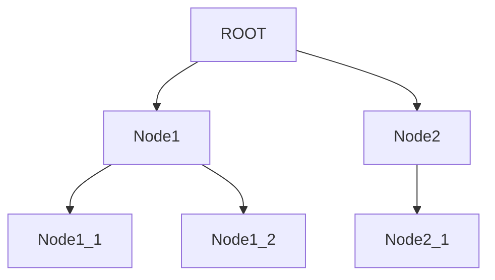

# 🌳 TreeNode  API

[](https://www.oracle.com/java/)
[](https://spring.io/projects/spring-boot)
[](LICENSE)

A RESTful API built with Spring Boot for managing hierarchical tree nodes.
Supports creating, moving, deleting nodes, and retrieving descendants with depth information.

---

## Table of Contents

* [Features](#features)
* [Environment](#environment)
* [Installation](#installation)
* [Project Structure](#project-structure)
* [Database Setup](#database-setup)
* [Application Configuration](#application-configuration)
* [Tree Visualization](#tree-visualization)
* [API Endpoints](#api-endpoints)

---

## Features

* Create child nodes
* Delete nodes and their subtrees
* Move nodes to a new parent (preventing cycles)
* Retrieve all descendants with depth information
* Supports modern Java features (JDK21)
* Transactional operations ensure data consistency

---

## Environment

* JDK 21 or higher
* Maven 3.8+
* MySQL 8+
* Spring Boot 3.x

---

## Installation

1. Clone the project:

```bash
git clone https://github.com/your-repo/treenode.git
cd treenode
```

2. Configure the database (application.yml or application.properties)
3. Build and run:

```bash
mvn clean spring-boot:run
```

4. Access the API:

```
http://localhost:8080/api/nodes
```

---

## Project Structure

```
treenode/
├─ src/
│  ├─ main/
│  │  ├─ java/com/example/treenode/
│  │  │  ├─ controller/       # Controller layer
│  │  │  │  └─ NodeController.java
│  │  │  ├─ service/          # Service layer
│  │  │  │  └─ NodeService.java
│  │  │  ├─ repository/       # Repository layer
│  │  │  │  └─ NodeRepository.java
│  │  │  ├─ entity/           # Entity classes
│  │  │  │  └─ NodeEntity.java
│  │  │  └─ dto/              # Data Transfer Objects
│  │  │     ├─ NodeDto.java
│  │  │     ├─ CreateNodeRequest.java
│  │  │     └─ MoveNodeRequest.java
│  │  └─ resources/
│  │     └─ application.yml
│  └─ test/
│     └─ java/com/example/treenode/
│        └─ NodeServiceTest.java
└─ pom.xml
```

---

## Database Setup

```sql
CREATE DATABASE IF NOT EXISTS treenode CHARACTER SET utf8mb4 COLLATE utf8mb4_unicode_ci;
USE treenode;

CREATE TABLE t_node (
    id BIGINT AUTO_INCREMENT PRIMARY KEY,
    name VARCHAR(255) NOT NULL,
    parent_id BIGINT NULL,
    CONSTRAINT fk_parent FOREIGN KEY (parent_id) REFERENCES t_node(id) ON DELETE CASCADE
);

-- Insert root node
INSERT INTO t_node (id, name, parent_id) VALUES (1, 'ROOT', NULL);
```

---

## Application Configuration

```yaml
spring.datasource.url=jdbc:mysql://localhost:3306/treenode?useSSL=false&serverTimezone=UTC
spring.datasource.username=root
spring.datasource.password=123456
spring.jpa.hibernate.ddl-auto=update
spring.jpa.show-sql=true
```

---

## Tree Visualization

### ASCII Tree

```
ROOT
├─ Node 1
│  ├─ Node 1.1
│  └─ Node 1.2
└─ Node 2
   └─ Node 2.1
```

### Mermaid Visualization



---

## API Endpoints

### Get All Nodes

```
GET /api/nodes
```

### Create Child Node

```
POST /api/nodes/{parentId}/children
Content-Type: application/json

{
  "name": "Child Node"
}
```

### Delete Child Node

```
DELETE /api/nodes/{parentId}/children/{childId}
```

### Move Node

```
PUT /api/nodes/{nodeId}/move
Content-Type: application/json

{
  "newParentId": 3
}
```

### Get All Descendants

```
GET /api/nodes/{id}/descendants
```
